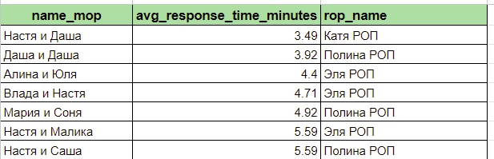

# Average Response Time Tracker

This project calculates the average response time of managers based on chat message data and automatically uploads the results to a Google Sheet. The process is automated using a scheduled job that runs every hour.

## Getting Started

### Prerequisites

Before you can run the project, ensure the following requirements are met:

**API Token and Configuration Files**  
   The project interacts with Google Sheets and your database. You'll need API tokens and database connection information.

   - `settings/google_api/token.json`: This file contains your Google Sheets API credentials. You will need to create a project in the Google Cloud Console, enable the Google Sheets API, and generate a service account key (in JSON format).
   - `settings/google_api/google_sheets_info.yaml`: Contains the Google Sheets ID and range information for where the result should be saved.
   - `settings/db_api/connect.yaml`: Defines the connection parameters for your database (e.g., host, port, user, password).

### Project Structure

```plaintext
AverageResponseTimeTracker/
├── programm_avarage_response.py    # Main script for calculating response time
├── settings/
│   ├── google_api/
│   │   ├── token.json              # Google API token file
│   │   └── google_sheets_info.yaml # Google Sheets configuration
│   └── db_api/
│       └── connect.yaml            # Database connection configuration
├── main.py                         # Script that schedules the task
└── requirements.txt                # Python dependencies
```

### Installation

To install and use the project, follow these steps:

1. **Clone the repository:**

    ```bash
    git clone https://github.com/yourusername/average-response-time-tracker.git
    cd average-response-time-tracker
    ```

2. **Install the required Python packages:**

   You can install the required dependencies using `pip` from the `requirements.txt` file, or if you're using alternative dependency management tools, you can also use `uv.lock` or `pyproject.toml`:

    ```bash
    pip install -r requirements.txt
    ```

   Alternatively, if you use `uv.lock` or `pyproject.toml`, install dependencies using:

    ```bash
    uv install
    ```

    or

    ```bash
    pip install -e .
    ```


3. **Configure Google Sheets API**  
   Follow these steps to set up the Google Sheets API:

   - Create a project in the [Google Cloud Console](https://console.developers.google.com/).
   - Enable the **Google Sheets API**.
   - Create a **service account** and download the credentials in JSON format.
   - Place the `token.json` file in the `settings/google_api/` directory.

4. **Configure Database Connection**  
   Edit the `settings/db_api/connect.yaml` file to add your database connection details:

    ```yaml
    host: your_database_host
    port: your_database_port
    user: your_database_user
    password: your_database_password
    name: your_database_name
    ```

### Usage

Run the `main.py` script to start the scheduler, which will execute the `programm_avarage_response.py` script every hour:

```bash
python main.py
```
### Installation for automatic launch
Execute the command:
- `docker compose up --build`

### Updating Repository Files
To update the project files in the repository, execute one of the following scripts depending on your operating system:

- For Windows: `update_repo_windows.bat`

## Results:


## About the Author

This project was created by a Data Analyst.  
GitHub: [NorgeyBilinskiy](https://github.com/NorgeyBilinskiy)  
Telegram: [Norgey](https://t.me/Norgey)

